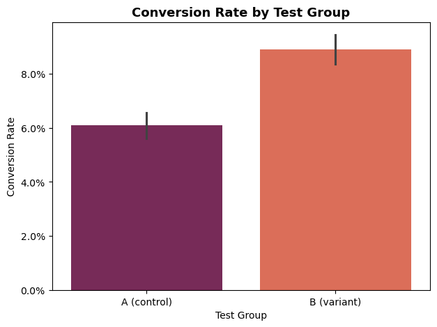
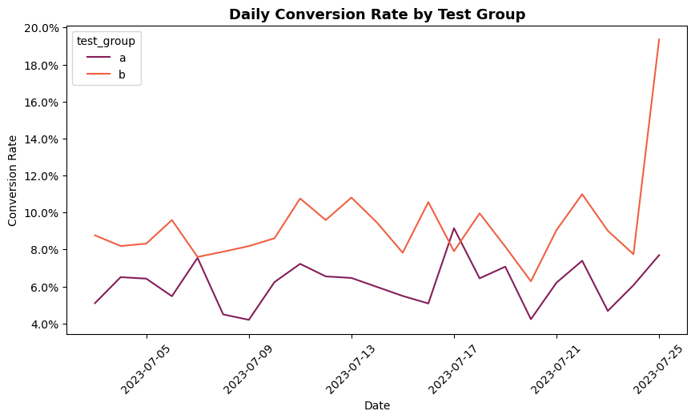

# 📊 A/B Test Analysis: Subscription Conversion

## 📌 Context

After onboarding, users in the mobile app are shown a weekly subscription offer priced at $4.99.

The A/B test was designed to see whether an alternative version of the subscription screen changes the conversion rate.  
In the new version, the price remained the same, but the offer included a “50% discount” label.

- **Group A (control):** standard offer  
- **Group B (variant):** same offer with an additional *"50% discount"* message  

Users were randomly assigned at the install level, so the effect is measured across the full funnel.

---

## 🎯 Objective

The goal of the A/B test was to see whether adding a discount label increases conversion to subscription.

---

## 📋 Results

| Metric        | Group A | Group B |
|--------------|--------|--------|
| Users        | 10,013 | 9,985  |
| Conversions  | 611    | 889    |
| Conversion   | 6.10%  | 8.90%  |

- Absolute uplift: **+2.8%**  
- Relative uplift: **+45.9%**

---

## 🧪 Statistical test

Since conversion is a binary outcome, I used a two-proportion z-test.

- p-value ≈ 5.37e-14  
- significance level: 0.05  

The p-value is much lower than 0.05, which means the difference between the groups is statistically significant.

---

## 📈 Visualization

  

Daily conversion shows some volatility, especially towards the end of the experiment, which is likely due to smaller daily sample sizes.

---

## 💡 Conclusion

The null hypothesis is rejected.

The difference between Group A and Group B is statistically significant and not due to random variation.

---

## 💼 Business interpretation

Even though the price did not change, the way the offer is presented had a strong impact on user behavior.

The “50% discount” label significantly increased the likelihood of purchase.

This suggests that framing plays an important role, and perceived value can influence conversion even without actual price changes.

---

## ✅ Recommendation

Roll out version B.

It is also important to monitor long-term metrics after the rollout.

---

## 📝 Notes

Further analysis could include:
- retention  
- refund rate  
- churn after first payment  
- lifetime value (LTV)  

to make sure the increase in conversion does not negatively affect user quality.

---

## ▶️ How to run

1. Clone the repository  
2. Open the notebook:  
   `notebook/z_test.ipynb`  
3. Make sure the dataset is in:  
   `data/ab_test_data.csv`  
4. Run all cells  

---

## 🔧 Tech stack

Python (pandas, seaborn, matplotlib)  
statsmodels (z-test)

---

## 🤓 About me

Hi! I’m Iryna 👋  

I’m currently transitioning into Data Analytics and building my skills through hands-on projects like this one.  

I enjoy working with real-world data (especially when it’s messy), asking the right questions, and turning data into insights that actually make sense.

---

## 📜 License

This project is licensed under the MIT License.
